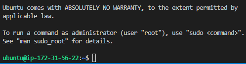
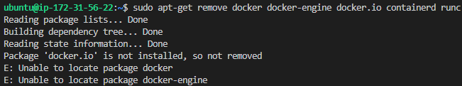
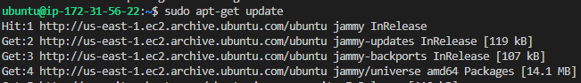
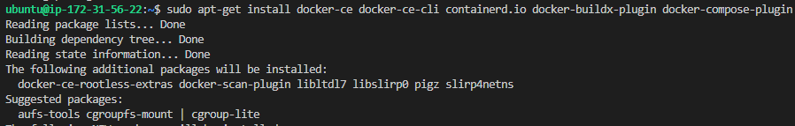
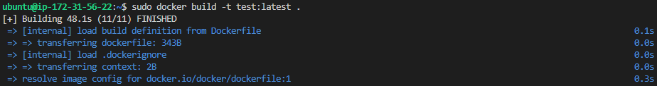
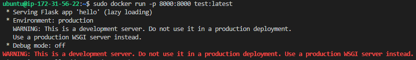
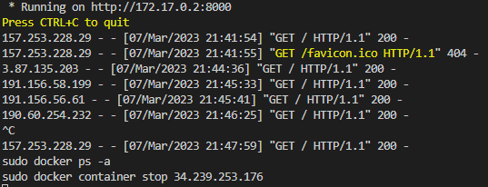
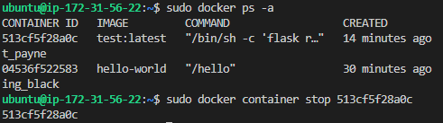

# Taller 6

### Docker

##### Analítica Computacional para la Toma de Decisiones

---

|     Nombres      |      Apellidos       |     Login     |  Codigo   |
| :--------------: | :------------------: | :-----------: | :-------: |
|     Santiago     | Gonzalez Montealegre | s.gonzalez35  | 202012274 |
| Juliana Carolina |  Cardenas Barragan   | jc.cardenasb1 | 202011683 |

---

---

## 1. Instale Docker y lance su primer contenedor de prueba

---

Nombre grupo e instancia: `Analistas6`
IP: 34.239.253.176
IP2: 54.87.237.118










11. Copie la salida en pantalla en su reporte

```shell
ubuntu@ip-172-31-56-22:~$ sudo docker run hello-world
Unable to find image 'hello-world:latest' locally
latest: Pulling from library/hello-world
2db29710123e: Pull complete
Digest: sha256:6e8b6f026e0b9c419ea0fd02d3905dd0952ad1feea67543f525c73a0a790fefb
Status: Downloaded newer image for hello-world:latest

Hello from Docker!
This message shows that your installation appears to be working correctly.

To generate this message, Docker took the following steps:
 1. The Docker client contacted the Docker daemon.
 2. The Docker daemon pulled the "hello-world" image from the Docker Hub.
    (amd64)
 3. The Docker daemon created a new container from that image which runs the
    executable that produces the output you are currently reading.
 4. The Docker daemon streamed that output to the Docker client, which sent it
    to your terminal.

To try something more ambitious, you can run an Ubuntu container with:
 $ docker run -it ubuntu bash

Share images, automate workflows, and more with a free Docker ID:
 https://hub.docker.com/

For more examples and ideas, visit:
 https://docs.docker.com/get-started/
```

---

---

## 2. Lance una aplicación sencilla en Python en un Docker

---

2. Abra el archivo Dockerfile y describa su contenido en su reporte. Para esto tenga presente que

- FROM determina la imagen base que se usa como sistema operativo y aplicaciones iniciales.
- RUN ejecuta comandos al interior del contenedor.
- COPY copia archivos del sistema hospedador (la máquina virtual) al contenedor.
- ENV permite definir variables de entorno.
- EXPOSE abre un puerto del contenedor.
- CMD es el comando que se ejecuta al lanzar el contenedor.








---

---

## 3. Lanzando otros contenedores


```
FROM node:current-slim

WORKDIR /usr/src/app
COPY package.json .
RUN npm install

EXPOSE 8080
CMD [ "npm", "start" ]

COPY . .
```


```
{
  "name": "vue-event-bulletin",
  "version": "1.0.0",
  "description": "Demo application for the scotch.io tutorial",
  "main": "server.js",
  "author": "Ryan Chenkie, Jason Lam",
  "license": "MIT",
  "dependencies": {
    "bootstrap": "^3.3.6",
    "ejs": "^2.3.4",
    "express": "^4.13.3",
    "morgan": "^1.6.1",
    "vue": "^1.0.10",
    "vue-resource": "^0.1.17"
  },
  "devDependencies": {
    "body-parser": "^1.14.1",
    "errorhandler": "^1.4.2",
    "method-override": "^2.3.5",
    "morgan": "^1.6.1"
  },
  "scripts": {
    "start": "node server.js"
  }
}
```
