# Taller 6

## Docker

##### Analítica Computacional para la Toma de Decisiones

---

|     Nombres      |      Apellidos       |     Login     |  Codigo   |
| :--------------: | :------------------: | :-----------: | :-------: |
|     Santiago     | Gonzalez Montealegre | s.gonzalez35  | 202012274 |
| Juliana Carolina |  Cardenas Barragan   | jc.cardenasb1 | 202011683 |

---

---

## Pre-requisitos

1. Para esta sesión va a requerir una cuenta de Amazon Web Services - AWS. Para esto hay varias opciones:
1. Utilizar una cuenta propia ya creada.
1. Crear una cuenta nueva. En este caso recuerde que requiere ingresar datos de una tarjeta de crédito. Usaremos recursos disponibles en la capa gratuita (https://aws.amazon.com/free/), pero es posible que se generen algunos costos menores.
1. Usar la cuenta de AWS Academy enviada a su correo por el instructor. En este caso emplee el Learner Lab.
1. Ingrese a su cuenta y familiarícese con la consola.
1. Asegúrese de que en la esquina superior derecha aparezca la región N. Virginia.
1. Nota: defina un nombre para su grupo, defínalo claramente en reporte y use este nombre como parte inicial de todos los recursos que cree.
1. Nota 2: la entrega de este taller consiste en un reporte y unos archivos de soporte. Cree el archivo de su reporte como un documento de texto en el que pueda fácilmente incorporar capturas de pantalla, textos y similares. Puede ser un archivo de word, libre office, markdown, entre otros.

---

---

## 1. Instale Docker y lance su primer contenedor de prueba

---

### 1.

En la consola de EC2 lance una instancia t2.micro, Ubuntu server con la configuración estándar.

**R/**

- Nombre grupo e instancia: `Analistas6`
- Dirección IPv4 pública: `54.160.108.255`
- Dirección IP privada: `172.31.56.22`


---

### 2.

Para conectarse a la instancia, en una terminal emita el comando

```shell
ssh -i /path/to/llave.pem ubuntu@IP
```

Donde /path/to/ se refiere a la ubicación del archivo `llave.pem` que descargó, e IP es la dirección IP de la instancia EC2 que lanzó. Si prefiere, en la terminal puede navegar a la ubicación del archivo `llave.pem` y emitir el comando

```shell
ssh -i llave.pem ubuntu@IP
```

Note que usamos en este caso ubuntu en vez de ec2-user, pues éste es el usuario creado por defecto como administrador con sistema operativo Ubuntu server.

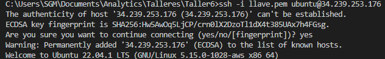


---

### 3.

Elimine versiones anteriores de Docker (esto genera un error si no hay versiones anteriores, en cuyo caso puede continuar también)

```shell
sudo apt-get remove docker docker-engine docker.io containerd runc
```


---

### 4.

Actualice el índice de paquetes

```shell
sudo apt-get update
```


---

### 5.

Instale dependencias

```shell
sudo apt-get install \
ca-certificates \
curl \
gnupg \
lsb-release
```

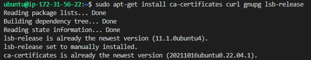

---

### 6.

Agregue la llave GPG de Docker

```shell
sudo mkdir -m 0755 -p /etc/apt/keyrings
curl -fsSL https://download.docker.com/linux/ubuntu/gpg | sudo gpg --dearmor -o /etc/apt/keyrings/docker.gpg
```


---

### 7.

Agregue el repositorio a su sistema

```shell
echo \
  "deb [arch=$(dpkg --print-architecture) signed-by=/etc/apt/keyrings/docker.gpg] https://download.docker.com/linux/ubuntu \
  $(lsb_release -cs) stable" | sudo tee /etc/apt/sources.list.d/docker.list > /dev/null
```

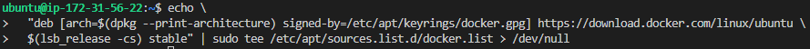

---

### 8.

Actualice nuevamente el índice de paquetes

```shell
sudo apt-get update
```

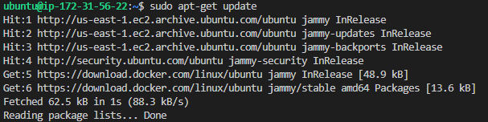

---

### 9.

Instale Docker Engine, containerd, y Docker Compose

```shell
sudo apt-get install docker-ce docker-ce-cli containerd.io docker-buildx-plugin docker-compose-plugin
```


---

### 10.

Para verificar su instalación, descargue, construya y ejecute la imagen hello-world

```shell
sudo docker run hello-world
```


---

### 11.

Copie la salida en pantalla en su reporte.

```shell
ubuntu@ip-172-31-56-22:~$ sudo docker run hello-world
Unable to find image 'hello-world:latest' locally
latest: Pulling from library/hello-world
2db29710123e: Pull complete
Digest: sha256:6e8b6f026e0b9c419ea0fd02d3905dd0952ad1feea67543f525c73a0a790fefb
Status: Downloaded newer image for hello-world:latest

Hello from Docker!
This message shows that your installation appears to be working correctly.

To generate this message, Docker took the following steps:
 1. The Docker client contacted the Docker daemon.
 2. The Docker daemon pulled the "hello-world" image from the Docker Hub.
    (amd64)
 3. The Docker daemon created a new container from that image which runs the
    executable that produces the output you are currently reading.
 4. The Docker daemon streamed that output to the Docker client, which sent it
    to your terminal.

To try something more ambitious, you can run an Ubuntu container with:
 $ docker run -it ubuntu bash

Share images, automate workflows, and more with a free Docker ID:
 https://hub.docker.com/

For more examples and ideas, visit:
 https://docs.docker.com/get-started/
```

---

---

## 2. Lance una aplicación sencilla en Python en un Docker

---

### 1.

Localmente descargue los archivos `Dockerfile` y `hello.py`, que acompañan este taller.

---

### 2.

Abra el archivo Dockerfile y describa su contenido en su reporte. Para esto tenga presente que

- `FROM` determina la imagen base que se usa como sistema operativo y aplicaciones iniciales.
- `RUN` ejecuta comandos al interior del contenedor.
- `COPY` copia archivos del sistema hospedador (la máquina virtual) al contenedor.
- `ENV` permite definir variables de entorno.
- `EXPOSE` abre un puerto del contenedor.
- `CMD` es el comando que se ejecuta al lanzar el contenedor.

```docker
# syntax=docker/dockerfile:1
FROM ubuntu:22.04

# install app dependencies
RUN apt-get update && apt-get install -y python3 python3-pip
RUN pip install flask==2.1.*

# install app
COPY hello.py /

# final configuration
ENV FLASK_APP=hello
EXPOSE 8000
CMD flask run --host 0.0.0.0 --port 8000
```

- `syntax=docker/dockerfile:1`: define la versión de la sintaxis del Dockerfile. En este caso, se está usando la versión 1 de la sintaxis de Docker.

- `FROM ubuntu:22.04`: indica la imagen base que se va a utilizar para construir la imagen de Docker. En este caso, se está utilizando la imagen de Ubuntu 22.04.

- `install app dependencies`
- `RUN apt-get update && apt-get install -y python3 python3-pip`: ejecuta un comando dentro de la imagen para instalar las dependencias necesarias para la aplicación. En este caso, se están actualizando los paquetes de Ubuntu con `apt-get update`, y luego con `apt-get install` se están instalando `python3` y `python3-pip`.

- `RUN pip install flask==2.1.*`: instala la librería `Flask` de Python usando el comando `pip install`. En este caso, se está instalando la versión `2.1.*` de Flask al interior del
  contenedor.

- `install app`
- `COPY hello.py /`: copia el archivo `hello.py` desde la ruta actual del sistema hospedador en el que se está construyendo el Docker al contenedor.
  Esto significa que el archivo `hello.py` estará disponible en la imagen de Docker.

- `final configuration`
- `ENV FLASK_APP=hello`: establece una variable de entorno llamada `FLASK_APP` con el valor hello. Esto indica a Flask que debe usar el archivo `hello.py` como la aplicación de Flask principal

- `EXPOSE 8000`: expone el puerto `8000` de la imagen. Esto significa que, cuando se ejecute la imagen de Docker, se podrá acceder a la aplicación a través del puerto `8000`.

- `CMD flask run --host 0.0.0.0 --port 8000`: establece el comando que se ejecutará cuando se inicie el contenedor. En este caso, el comando es flask run, lo que iniciará la aplicación Flask. Los argumentos `--host 0.0.0.0` y `--port 8000` indican que la aplicación debe escuchar en todas las direcciones IP (0.0.0.0) y en el puerto 8000.

---

### 3.

Copie estos archivos a su máquina remota. Suponiendo que tanto estos archivos como su llave .pem se encuentran en la misma carpeta, navegue a esta carpeta y emita el comando

```shell
scp -i key.pem Dockerfile ubuntu@IP:/home/ubuntu
```

Repita para hello.py.

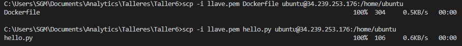

---

### 4.

Conéctese nuevamente a la máquina y verifique que los dos archivos se encuentran disponibles en la misma carpeta.

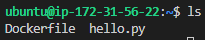

---

### 5.

Desde esta carpeta construya (build) la imagen con el comando

```shell
sudo docker build -t test:latest .
```

Aquí `test` es el nombre del contenedor, latest es la versión y el punto `.` define que el folder de contexto para la ejecución es la carpeta actual. Esto implica que tanto el `Dockerfile` que define al contenedor como el archivo `hello.py` que se copia al contenedor deben estar en la misma carpeta, desde donde se ejecuta la instrucción anterior. Una vez se haya ejecutado la construcción del contenedor, tome un pantallazo e inclúyalo en su reporte.


---

### 6.

Ahora ejecute el contenedor con el comando

```shell
sudo docker run -p 8000:8000 test:latest
```

Note que además de indicar el nombre y versión del contenedor a ejecutar, se enlazan el puerto 8000 del contenedor con el mismo de la máquina, para así hacer disponible lo que se exponga a través de este puerto a la máquina.


---

### 7.

Abra el puerto 8000 en su instancia y explore en el navegador la aplicación lanzada.

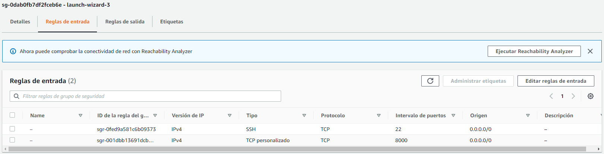
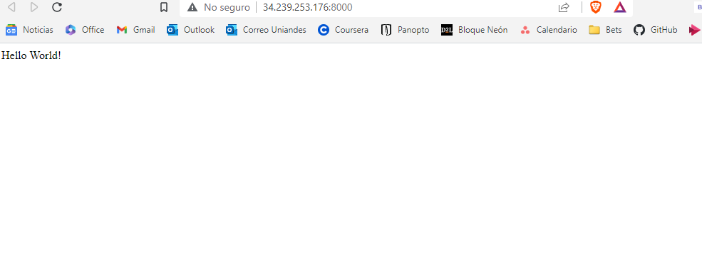

---

### 8.

Por Slack envíe la URL completa para acceder a la aplicación desplegada (IP:puerto). En su reporte incluya un pantallazo del navegador con la aplicación funcionando.

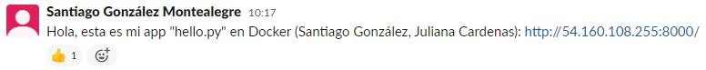

---

### 9.

En la terminal de la máquina detenga el proceso con CTRL+C. Si tiene dificultades conéctese a la máquina con otra terminal, liste los contenedores disponibles con

```shell
sudo docker ps -a
```


Confirme el ID del contenedor que está corriendo y deténgalo con

```shell
sudo docker container stop ID
```

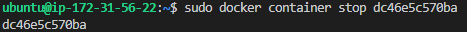

Verifique que el proceso de la aplicación haya terminado en la terminal donde la ejecutó.

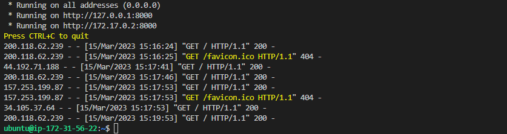

---

---

## 3. Lanzando Otros contenedores

---

Lance un nuevo contenedor y conéctese a la terminal interactiva del mismo usando bash con el comando

sudo docker run -it ubuntu bash
Copie la salida en pantalla en su reporte.

Note que en este caso ha quedado conectado a la terminal del contenedor. En la terminal del contenedor verifique la estructura de archivos con ls. En su reporte incluya las carpetas disponibles en el directorio raíz.

Salga de la terminal del contenedor con exit

Liste todos los contenedores disponibles con el comando

sudo docker ps -a
Incluya un pantallazo con el listado y sus características en su reporte.

En la VM clone el repositorio de prueba

git clone https://github.com/dockersamples/node-bulletin-board
Navegue al directorio del repositorio

cd node-bulletin-board/bulletin-board-app
Liste todos los archivos en esta carpeta en su reporte.

Explore el Dockerfile, ¿qué información encuentra allí? Explique los comandos en su reporte.

Explore el package.json, ¿qué información encuentra allí? Inclúyala en su reporte.

Construya la imagen

sudo docker build --tag bulletinboard:1.0 .
Ejecute el contenedor con nombre bb y publíquelo en el puerto 8000

sudo docker run --publish 8000:8080 --detach --name bb bulletinboard:1.0
Liste todos los contenedores disponibles con el comando

sudo docker ps -a
Incluya un pantallazo con el listado y sus características en su reporte.

Abra el puerto 8000 en su instancia y explore en el navegador la aplicación lanzada. En su reporte explique por qué en este caso se publica en los puertos 8000:8080 y antes se hacía en 8000:8000.

Por Slack envíe la URL completa para acceder a la aplicación desplegada (IP+puerto).

---

2. Abra el archivo Dockerfile y describa su contenido en su reporte. Para esto tenga presente que

- FROM determina la imagen base que se usa como sistema operativo y aplicaciones iniciales.
- RUN ejecuta comandos al interior del contenedor.
- COPY copia archivos del sistema hospedador (la máquina virtual) al contenedor.
- ENV permite definir variables de entorno.
- EXPOSE abre un puerto del contenedor.
- CMD es el comando que se ejecuta al lanzar el contenedor.

---

---

## 3. Lanzando otros contenedores

1. Lance un nuevo contenedor y conéctese a la terminal interactiva del mismo usando
   bash con el comando

2. Note que en este caso ha quedado conectado a la terminal del contenedor. En la
   terminal del contenedor verifique la estructura de archivos con ls. En su reporte
   incluya las carpetas disponibles en el directorio raíz.

3. Liste todos los contenedores disponibles con el comando
   `sudo docker ps -a`
   Incluya un pantallazo con el listado y sus caracter´ısticas en su reporte.

4. Liste todos los archivos en esta carpeta en su reporte

5. Explore el Dockerfile, ¿qué informaci´on encuentra allí? Explique los comandos en
   su reporte.

6. Explore el package.json, ¿qué informaci´on encuentra allí? Inclúyala en su reporte.

7. Liste todos los contenedores disponibles con el comando
   `sudo docker ps -a`
   Incluya un pantallazo con el listado y sus características en su reporte.

8. Abra el puerto 8000 en su instancia y explore en el navegador la aplicación lanzada.
   En su reporte explique por qué en este caso se publica en los puertos 8000:8080 y
   antes se hacía en 8000:8000.

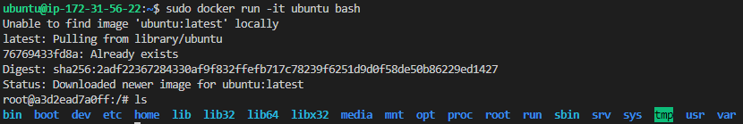

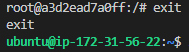

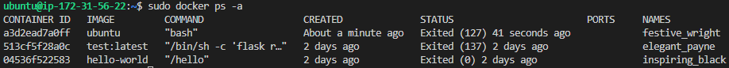
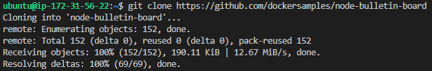

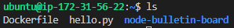
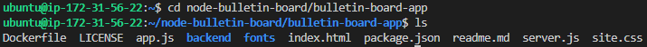
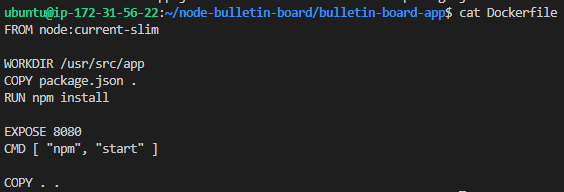

```
FROM node:current-slim

WORKDIR /usr/src/app
COPY package.json .
RUN npm install

EXPOSE 8080
CMD [ "npm", "start" ]

COPY . .
```

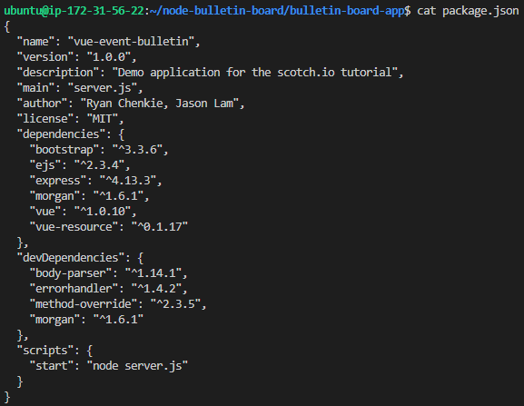

```
{
  "name": "vue-event-bulletin",
  "version": "1.0.0",
  "description": "Demo application for the scotch.io tutorial",
  "main": "server.js",
  "author": "Ryan Chenkie, Jason Lam",
  "license": "MIT",
  "dependencies": {
    "bootstrap": "^3.3.6",
    "ejs": "^2.3.4",
    "express": "^4.13.3",
    "morgan": "^1.6.1",
    "vue": "^1.0.10",
    "vue-resource": "^0.1.17"
  },
  "devDependencies": {
    "body-parser": "^1.14.1",
    "errorhandler": "^1.4.2",
    "method-override": "^2.3.5",
    "morgan": "^1.6.1"
  },
  "scripts": {
    "start": "node server.js"
  }
}
```

### 4. Mas operaciones en Docker

1. Liste las im´agenes locales
   `sudo docker image ls`
   Incluya el resultado en su reporte.

2. Liste los contenedores locales en ejecuci´on.
   `sudo docker container ls`
   Incluya el resultado en su reporte.

3. Liste todos los contenedores locales.
   `sudo docker container ls -a`
   Incluya el resultado en su reporte. Describa las diferencias entre im´agenes, contenedores y contenedores en ejecuci´ons.

4. Intente eliminar la imagen hello-world
   `sudo docker image rm hello - world`
   Incluya el resultado en su reporte. ¿Por qu´e no es posible eliminar la imagen?

5. Elimine imagen hello-world
   `sudo docker image rm --force hello - world`
   Incluya el resultado en su reporte. Verifique que la imagen (y el contenedor asociado) se hayan eliminado. Incluya un pantallazo de los comandos y la salida en su
   reporte.

6. Traiga la imagen de hello-world del registro
   `sudo docker pull hello - world`
   Incluya el resultado y su interpretaci´on en su reporte. Verifique que la imagen se
   encuentre localmente.

7. Traiga la imagen del servidor web apache (httpd) del registro
   `sudo docker pull httpd`
   Incluya el resultado y su interpretaci´on en su reporte. Verifique que la imagen se
   encuentre localmente

8. Verifique que la imagen se encuentre localmente
   `sudo docker images`
   Incluya un pantallazo del resultado en su reporte.

9. Usando esta imagen lance un contenedor con nombre docker-apache y acople el
   puerto 80 de la m´aquina con el puerto 80 del contenedor
   `sudo docker run -d --name docker - apache -p 80:80 -d httpd`
   El servidor debe estar corriendo por el puerto 80, luego debe poder accederlo desde
   el navegador solamente con la IP. Incluya un pantallazo del resultado en su reporte.

10. Pruebe ahora a detener el contenedor con el comando
    `sudo docker container stop docker - apache`
    Verifique en su navegador que el servicio se ha detenido. Tome un pantallazo para
    su reporte.

11. Reinicie nuevamente contenedor con el comando
    `sudo docker container start docker - apache`
    Verifique en su navegador que el servicio ha regresado. Tome un pantallazo para su
    reporte.

12. Para ver los ´ultimos 10 registros del log de su contenedor ejecute el comando
    `sudo docker container logs --tail 10 docker-apache`
    Incluya el resultado en su reporte.

13. Env´ıe por Slack e incluya en su reporte el enlace a su repositorio con la imagen.
